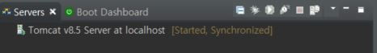
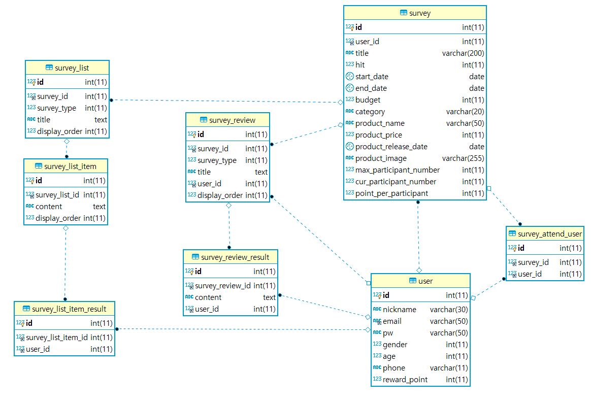
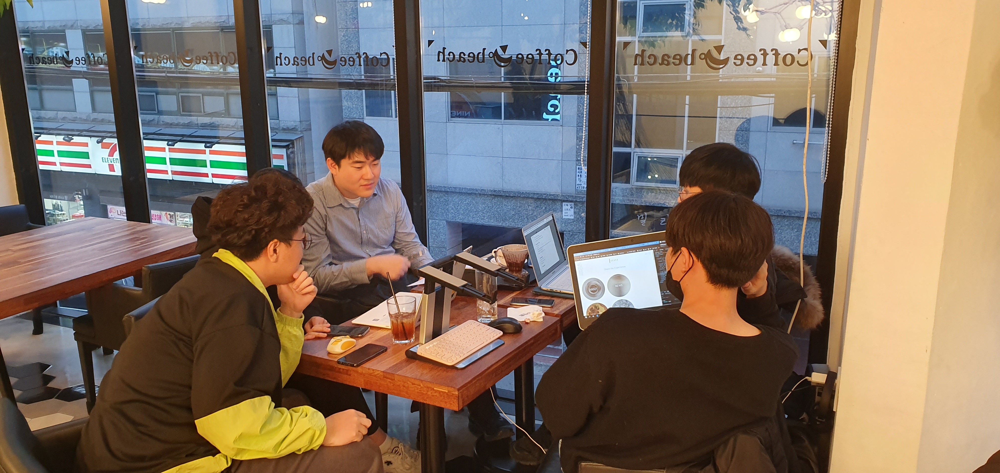

# An-Early ( Advertisement based on Web Platform)

An-Early은 웹 광고 설문 플랫폼입니다. 광고주가 출시할 제품에 대한 설문 혹은 필요한 정보에 대한 설문 정보를 필요로 할 때 사용할 수 있는 웹 플랫폼 제작을 목표로 하고 있습니다. 본 프로젝트는 React, Spring boot, MyBatis, MariaDB 을 기반입니다. 또한 Agile 방법론을 도입하여 매일 Scrum을 진행하고 task를 할당하는 방식으로 개발을 진행하였습니다. 이 프로젝트의 목표는 배포할만큼의 높은 퀄리티의 웹 어플리케이션을 개발하고 더 궁극적으로는 실질적으로 제품에 대한 사전 설문이 가능한 광고 플랫폼으로 나아가는 것입니다.


## 핵심 기능 및 기대 효과

광고주는 설문을 작성함으로써 출시할 제품에 대한 시장 반응을 보다 쉽게 획득하여 피드백을 받을 수 있습니다. 또한 설문조사 전 상품에 대한 설명이 사용자들에게 자연스럽게 노출됨으로써 광고효과를 얻을 수 있습니다.


일반 사용자들은 어떤 제품들이 출시 될 지 미리 정보를 획득할 수 있으며, 설문 답변을 통해 리워드를 받을 수 있습니다. 특히 길거리 광고판을 이용해서 접근한 유저들의 경우 획득한 영상 정보를 바탕으로 나이, 성별을 식별하여 해당 나이, 성별이 관심을 가질 설문을 상단에 띄워 줌으로써 일반 사용자들의 설문 참여도를 높일 수 있습니다.


## 주요 사용자

- 관리자: 유저 관리, 설문 관리(승인, 종료, 삭제).
- 설문 작성자: 설문을 만들고 등록. 내가 만든 설문에 대한 결과 조회.
- 설문 답변자: 사이트에 등록된 설문들을 보고 설문에 참여할 수 있습니다.
  - 직접 접속한 사람
  - 전광판에서 보는 사람: 설문하는 사람의 영상 정보에서 얻어진 나이와 성별에 기반한 추천 설문을 볼 수 있습니다.


## **Before You Begin**

이 프로젝트를 다운로드 받아서 가공하기 위해서는 다음과 같은 배경 지식이 필요합니다.

- MariaDB - Spring boot 기반에서 MariaDB의 활용에 대한 지식
- MyBatis - [MyBatis Official Web Site](https://mybatis.org/mybatis-3/ko/getting-started.html) 에서 매퍼, 설정 그리고 쿼리에 대한 지식
- Spring boot - Spring boot Framework 에 대한 이해 및 Restful API의 지식
- React - [Single Page Application](https://en.wikipedia.org/wiki/Single-page_application) 구조 및 React 문법과 [Material-ui](https://material-ui.com/) 활용
- IoT - 아두이노 센서 데이터 입 출력 및 시리얼, 블루투스, 와이파이 통신에 대한 지식
- OpenCV - 영상데이터 처리(얼굴 감지, 나이, 성별 감지)에 대한 지식


## **Prerequisites**

Make sure you have installed all of the following prerequisites on your development machine:

- Git - [Download & Install Git](https://git-scm.com/downloads). OSX and Linux machines typically have this already installed.
  OSX와 Linux 는 기본적으로 설치되어 있습니다.
- Node.js - [Download & Install Node.js](https://nodejs.org/en/download/) and the npm package manager. If you encounter any problems, you can also use this [GitHub Gist](https://gist.github.com/isaacs/579814) to install Node.js. Node.js와 NPM package manager를 설치해주세요.
- MariaDB - [Download MariaDB](https://mariadb.com/downloads/) and Install it, make sure it's running on the default installed port. MariaDB를 다운로드하여 설치하고, 설치된 포트가 기본으로 돌아가게 합니다.
- Apache-tomcat - Need to install Apache Tomcat Server 8.5 Version
- STS - you should install a spring boot development tool Like [Spring Tool Suite](https://spring.io/tools3/sts/all) or else, 스프링 부트 개발 툴을 설치해야 합니다.
- Visual Studio Code - You're going to use VS Code for front development, Install [VS Code](https://code.visualstudio.com/),Front-End Code의 경우 Visual Studio Code로 보는 것이 편합니다.
- Arduino IDE -  you should install a arduino development tool. [Download Ardudino IDE](https://www.arduino.cc/en/main/software). 아두이노 개발 환경을 설치해야 합니다.
- OpenCV - you should install a OpenCV on raspberry pi 4. [Download and install OpenCV](https://www.pyimagesearch.com/2019/09/16/install-opencv-4-on-raspberry-pi-4-and-raspbian-buster/).


## **Downloading An Early**

다운로드 방법입니다.

### **Cloning The GitHub Repository**

The recommended way to get An-Early is to use git to directly clone this repository:

가장 추천하는 다운로드 방법은 Git Repository에서 받는것입니다.

git clone https://lab.ssafy.com/webmobile3-sub3/s02p13d101.git

This will clone the latest version of the repository to a project folder.

가장 최신의 project 폴더를 clone할 것입니다. web folder 코드의 경우는 VS Code에서 열어서 사용하시길 바랍니다.

restapi-server 코드는 경우는 STS에서 Import하는 것을 추천합니다.


## **Quick Install**

To install the dependencies, run this in the application folder from the command-line:

$ npm install

This command does a few things:

- First it will install the dependencies needed for the application to run.
- If you're running in a development environment, it will then also install development dependencies needed for testing and running your application.
- When the npm packages install process is over, npm will initiate a bower install command to install all the front-end modules needed for the application
- To update these packages later on, just run `npm update`

To import Server Code, recommend this flow

- Open STS
- Right Click in Package Explorer
- Import
- Maven
- Check out Maven Projects from SCM
- Copy to the block " [https://lab.ssafy.com/webmobile3-sub3/s02p13d101.git](https://lab.ssafy.com/webmobile3-sub3/s02p13d101.git) "
- Next
- Fininsh

Change inner Database Server to Apache Tomcat Server 8.5



- Find Server Tap
- Right Click in This Tap
- Click New
- Find Apache-Tomcat
- Find Apache and Click
- Find Tomcat 8.5 and Add Tomcat Server with your path


## **Running Your Application**

Create Database.

Run Query File with MariaDB Client or Gui Database Tool

Making a DB and Tables, Inserting Sample Data

$ source  fileDirectory/anearly 테이블 create 및 sample data insert문.sql

Run Spring boot Application

After import Server Code in Spring boot Development Tool, Run Application File

Your Server should run on port 9999

Run your application using npm:

$ npm start

Your application should run on port 3000 with the *development* environment configuration, so in your browser just go to [http://localhost:3000](http://localhost:3000/)

That's it! Your application should be running. To proceed with your development, check the other sections in this documentation. If you encounter any problems, try the Troubleshooting section.


## **Testing Your Application**

## **Running your application with Gulp**

## **Development and deployment With Docker**

### **Production deploy with Docker**

## **Deploying to PAAS**

## **An-Early-ER-Diagram**




## **Data input and output for each page**

### MyPage - MyPageIndex component

#### input

유저 데이터를 받아와서 보여줍니다.

```javascript
{
    "id": 0
    "nickName": "마이트랩카드",
    "email": "mytrapcard@gmail.com",
    "gender": 0,
    "age": 25,
    "phone": "010-0000-0000",
    "rewardPoint": 1234,
}
```


### MyPage - UserUpdate component

#### input

유저 데이터를 받아와서 보여줍니다.

```javascript
{
    "userId": "미니언즈",
    "nickName": "마이트랩카드",
    "email": "mytrapcard@gmail.com",
    "gender": 0,
    "age": 25,
    "phone": "010-0000-0000",
    "rewardPoint": 1234,
}
```


#### output

수정한 유저 데이터를 서버에 전송합니다.

```javascript
{
  "age": 0,
  "authority": "string",
  "email": "string",
  "email_verification": "string",
  "gender": 0,
  "id": 0,
  "nickname": "string",
  "phone": "string",
  "pw": "string",
  "reward_point": 0
}
```


### MyPage - MySurvey component

#### input

내가 설문한 데이터들을 모두 받아옵니다.

```javascript
 [
     {설문 1},
     {설문 2},
     ...
 ]
```

각 각의 설문은 다음과 같은 구조로 이루어져 있습니다.

```javascript
{
    "id": 1,
    "user_id": 1,
    "title": "survey 1번입니다.",
    "hit": 0,
    "start_date": "2020-02-03",
    "end_date": "2020-02-25",
    "budget": 1000000,
    "category": "IT",
    "product_name": "제품 1번",
    "product_price": 50000,
    "product_release_date": "2020-03-25",
    "product_image": "경로1번입니다",
    "max_participant_numbmer": 1000,
    "cur_participant_number": 10,
    "point_per_participant": 1000,
},
```


### MyPage - VoteResult Component

#### input

각 설문 번호에 해당하는 설문 데이터를 받아옵니다.

```javascript
[
    {설문 1},
    {설문 2},
    ...
]
```

각 설문은 다음과 같은 구조로 이루어져 있습니다.

```javascript
{
	"title": "asdfasdf",
	"selects": [
            {선택지 1},
            {선택지 2},
            ...
    	]
}
```

각 선택지들은 다음과 같은 구조를 가지고 있습니다.

```javascript
{
    "content": "내용",
    "count": 이 선택지를 선택한 사람 수
}
```


### MyPage - MyReward component

#### input

내가 참여한 설문에 대한 정보들을 받아옵니다.

```javascript
[
    {참여내역 1},
    {참여내역 2},
    ...
]
```

참여내역들은 다음과 같은 구조를 가지고 있습니다.

```javascript
{
    "No": 설문참여 인덱스,
    "survey_id": 참여한 설문의 ID,
    "point_per_participant": 획득한 리워드
}
```


### CreateSurvey

#### output

새로 만들 설문에 대한 정보를 작성해서 서버로 보내줍니다.

```javascript
{
    title: "",
    max_participant_number: 0,
    option: 0,
    start_date: defaultDate,
    end_date: defaultDate,
    category: categories[0],
    product_name: "",
    product_price: 0,
    product_release_date: defaultDate,
    product_image: "",
    content: "",
    point_per_participant: 0,
    survey: [
        {설문 1},
        {설문 2},
        ...
    ],
  }
```

각 각의 설문은 주관식 혹은 객관식 문항입니다.

객관식 문항은 다음과 같이 구성되어 있습니다.

```javascript
{
    survey_type: 1,
    title: "설문 주제입니다"
    display_order: 출력
	selects: [
        {선택지 1},
        {선택지 2},
        ...
    ]
}
```


### VoteInfo

#### input

리스트 안의 객체 하나 하나가 주관식 혹은 객관식 문항 하나에 대응합니다.

```javascript
[
    {문항1},
    {문항2},
    ...
]
```


객관식 문항의 경우

```js
{
    "img": "",
    "id": 1,
    "survey_id": 1,
    "survey_type": 1,
    "title": "1번 설문 객관식 1번 문항입니다.",
    "display_order": 0,
    "list": [
    	      {
                 "id": 1,
		         "survey_list_id": 1,
				 "content": "1번 설문 1번 문항 객관식 1번 보기입니다.",
				 "display_order": 0
			  },
			  {
				"id": 2,
				"survey_list_id": 2,
				"content": "1번 설문 1번 문항 객관식 2번 보기입니다.",
				"display_order": 1
			  }
			]
}
```


주관식 문항의 경우

```javascript
{
  "img": null,
  "id": 1,
  "survey_id": 1,
  "survey_type": 2,
  "title": "1번 유저 1번 설문 2번 문항 주관식입니다.",
  "display_order": 1,
  "list": null
}
```


#### output

리스트 안에 객체 하나 하나가 주관식 혹은 객관식 문항 하나에 대응한다.

```javascript
[
	{답변1},
	{답변2},
	...
]
```


객관식 문항의 경우

```js
{
    "survey_type": "1",
    "id": "1" // id값은 보기의 id값이다.(list.id)
}
```


주관식 문항의 경우

```javascript
{
    "survey_type": "2",
    "id": "1" // id 값은 문항의 id값이다.(id)
}
```


## **Data input and output for embeded system**

조이스틱 데이터를 입력 받아 아두이노 보드에서 종합한 후 종합된 데이터를 블루투스 모듈을 통해 라즈베리파이로 전송합니다.

라즈베리파이에선 수신한 데이터를 바탕으로 마우스 커서를 조작합니다.

조이스틱을 라즈베리파이의 마우스처럼 사용 가능하게 됩니다.


아두이노 코드

```C
#include <SoftwareSerial.h>

SoftwareSerial BTSerial(12, 13); //Connect HC-06. Use your (TX, RX) settings
const int joystick_x = A0;    
const int joystick_y = A1;
const int joystick_A = 2;
const int joystick_B = 3;
const int joystick_C = 4;
const int joystick_D = 5;
const int joystick_E = 6;
const int joystick_F = 7;
int sum;
int A, B, Au, Bu, u;
int button_chk;
int tmp;

void setup()  
{
  pinMode ( joystick_A, INPUT_PULLUP );
  pinMode ( joystick_B, INPUT_PULLUP );
  pinMode ( joystick_C, INPUT_PULLUP );
  pinMode ( joystick_D, INPUT_PULLUP );
  pinMode ( joystick_E, INPUT_PULLUP );
  pinMode ( joystick_F, INPUT_PULLUP );
  Serial.begin(9600);
  Serial.println("Hello!");
  BTSerial.begin(9600);  // set the data rate for the BT port
  button_chk = 0;
}

void loop()
{
  sum = 0;
  sum = !digitalRead(joystick_A) << 1;
  sum = (sum + !digitalRead(joystick_B)) << 1;
  sum = (sum + !digitalRead(joystick_C)) << 1;
  sum = (sum + !digitalRead(joystick_D)) << 1;
  sum = (sum + !digitalRead(joystick_E)) << 1;
  sum = (sum + !digitalRead(joystick_F));
  if (sum == tmp) {
    button_chk = 0;
  }
  else {
    tmp = sum;
    if (tmp) {
      button_chk = 1;
    }
    else {
      button_chk = 0;
    }
  }
  A = map(analogRead(joystick_x), 0, 1023, -127, 127);
  B = map(analogRead(joystick_y), 0, 1023, -127, 127);
  u = (A*A+B*B) >> 5;
  if (button_chk || u) {
    Au = ((A+8) >> 4);
    Bu = ((B+8) >> 4);
    BTSerial.print(sum);
    BTSerial.print(Au + 127);
    BTSerial.print(Bu + 127);
    delay(1);  
  }
}
```


라즈베리파이 코드

```python
from bluetooth import *
import pyautogui as pg
import cv2, glob, dlib
import requests
import json

display_min_x = 1
display_min_y = 1
display_max_x = 1023
display_max_y = 767
url = 'http://192.168.100.60:9999/api/person'
age_list = ['(0, 2)','(4, 6)','(8, 12)','(15, 20)','(25, 32)','(38, 43)','(48, 53)','(60, 100)']
age_avg = [1, 5, 10, 17, 28, 40, 50, 80]
gender_list = ['Male', 'Female']

rasp_socket=BluetoothSocket( RFCOMM )
rasp_socket.connect(("00:19:10:08:58:C7", 1))
print("bluetooth Connected!")
chk = True
while chk:
    try:
        #msg = input("send message : ")
        #if msg == "end":
        #    break
        #rasp_socket.send(msg)
        #display size 1024 768
        s = ['button', 'sitck x', 'stick y']
        a = list(rasp_socket.recv(1024))    
        for i in range(1, len(a)-1, 3):
            px, py = a[i] - 127, 127 - a[i+1]
            cx, cy = pg.position()
            nx, ny = max(display_min_x, min(display_max_x, (cx + px))), max(display_min_y, min(display_max_y, (cy+py)))
            pg.moveTo(nx, ny)
            if a[i-1]:
                print(a[i-1])
                #button1 = 16
                if a[i-1] == 16:  
                    detector = dlib.get_frontal_face_detector()            
                    age_net = cv2.dnn.readNetFromCaffe(
                              'models/deploy_age.prototxt', 
                              'models/age_net.caffemodel')
                    gender_net = cv2.dnn.readNetFromCaffe(
                              'models/deploy_gender.prototxt', 
                              'models/gender_net.caffemodel')
                    cap = cv2.VideoCapture("http://192.168.137.252:8080/video")
                    ret, img = cap.read()
            
                    cap.release()
                    faces = detector(img)
                    print(len(faces))
                    if len(faces):
                        x1, y1, x2, y2 = faces[0].left(), faces[0].top(), faces[0].right(), faces[0].bottom()
                        face_img = img[y1:y2, x1:x2].copy()
                        blob = cv2.dnn.blobFromImage(face_img, scalefactor=1, size=(227, 227),
                          mean=(78.4263377603, 87.7689143744, 114.895847746),
                          swapRB=False, crop=False)
              
                        # predict gender
                        gender_net.setInput(blob)
                        gender_preds = gender_net.forward()
                        gender = gender_list[gender_preds[0].argmax()]
              
                        # predict age
                        age_net.setInput(blob)
                        age_preds = age_net.forward()
                        age = age_list[age_preds[0].argmax()]
              
                        print(gender, age)
                        
                        data= {
                          'gender': gender_list.index(gender)+1,
                          'age': age_avg[age_list.index(age)],
                          'device_number': 1,
                        }
                        print(json.dumps(data))
                        requests.post(url, json=data)
                elif a[i-1] == 32:
                    chk = False
                    break
                else:
                    pg.click()
        ## pg.click()
        print(a)
    except:
        continue
rasp_socket.close()

```


### 아두이노

#### 센서 테이터를 받아올 핀 번호

| 핀 번호 |   조이스틱    | 출력 값 범위 |
| :-----: | :-----------: | :----------: |
|   A0    | 조이스틱 가로 |   0 ~ 1023   |
|   A1    | 조이스틱 세로 |   0 ~ 1023   |
|    2    |    버튼 1     |   On / Off   |
|    3    |    버튼 2     |   On / Off   |
|    4    |    버튼 3     |   On / Off   |
|    5    |    버튼 4     |   On / Off   |
|    6    |    버튼 5     |   On / Off   |
|    7    |    버튼 6     |   On / Off   |

아두이노 보드 바우드 9600

전송 데이터 단위 byte(0 ~ 255)


#### 보낼 센서 데이터

| 조이스틱 가로 | 조이스틱 세로 |    조이스틱버튼     |
| :-----------: | :-----------: | :-----------------: |
|     0~255     |     0~255     | 00000000 ~ 11111111 |

조이스틱 버튼의 경우 n번째 비트가 n번 버튼의 On / Off에 대응하도록 합쳐서 보내 줍니다.


### 라즈베리파이

#### 아두이노로부터 받아 온 데이터를 마우스 조작을 위해 데이터 맵핑

|     변수      | 입력 값 범위 | 출력 값 범위 |
| :-----------: | :----------: | :----------: |
| 조이스틱 가로 |   0 ~ 255    |  -127 ~ 127  |
| 조이스틱 세로 |   0 ~ 255    |   0 ~ 255    |
| 조이스틱 버튼 |   0 ~ 255    |   변경없음   |

이 값에 의거하여 마우스 포인터를 조작합니다.


조이스틱 버튼의 값이 16일 경우 웹캠으로부터 이미지를 가져와 나이와 성별을 구합니다.

받아온 정보를 서버에 전송합니다.

이 정보를 바탕으로 메인 페이지에서 보여줄 설문을 선정합니다.(성별에 맞고 나이에 근접한 설문 순)

| 변수          | 데이터 범위 |
| ------------- | ----------- |
| age           | 정수        |
| gender        | 1 or 2      |
| device_number | 정수        |


## **Contributing**

## **Credits**

## **License**

Samsung Software Academy For Youth 2th, Team An-Early

